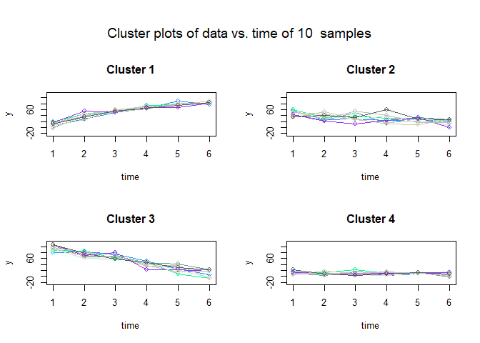

<!-- README.md is generated from README.Rmd. Please edit that file -->

# traj

<!-- badges: start -->
<!-- badges: end -->

The goal of $\texttt{traj}$ is to implement the three-step procedure
proposed by Leffondree et al. (2004) to identify clusters of individual
longitudinal trajectories. The procedure involves (1) calculating 24
measures describing the features of the trajectories; (2) using factor
analysis to select a subset of the 24 measures and (3) using cluster
analysis to identify clusters of trajectories, and classify each
individual trajectory in one of the clusters.

## Installation

You can install the development version of $\texttt{traj}$ from
[GitHub](https://github.com/) with:

``` r
# install.packages("devtools")
devtools::install_github("tchouangue/traj")
```

## Example

This is a basic example which shows you how to solve a common problem:

``` r
library(traj)

# Step 1. Setup data 
data = example.data$data

# Step 2. Computing 24 measures of each trajectory
s1 = step1measures(data, ID=TRUE)
#> [1] "Correlation of m5 and m6 : 1"
#> [1] "Correlation of m12 and m13 : 1"
#> [1] "Correlation of m17 and m18 : 0.999"

# Step 3. Factor analysis  
s2 = step2factors(s1)
#> [1] "m6 is removed because it is perfectly correlated with m5"  
#> [2] "m13 is removed because it is perfectly correlated with m12"
#> [1] "Computing reduced correlation e-values..."

# Step 4. Clustering the trajectories
s3 = step3clusters(s2, nclusters = 4)

plot(s3)
```



<!-- With a different database, make sure to well preprocess it in order to clean the data and if necessary, remove outliers. -->
